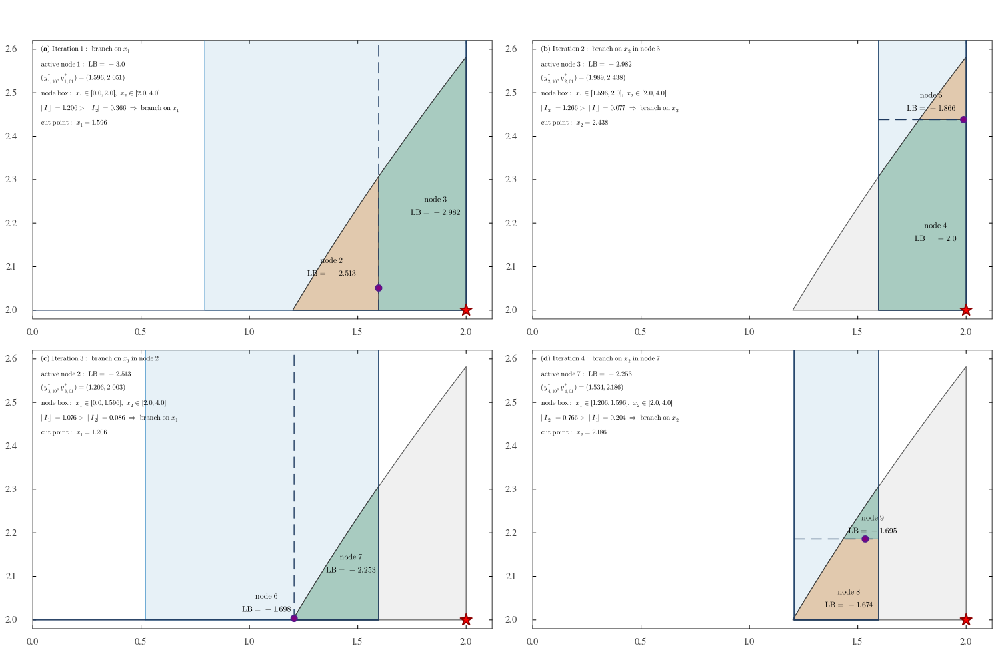

# CDK-Guided Branch-and-Bound for Polynomial Optimization

This folder contains a minimal GitHub-facing bundle for the CDK-guided Branch-and-Bound code developed in `BaBEXPs`.

The goal of the method is to solve a general Polynomial Optimization Problem (POP)

$$
\min_{x \in K} f(x),
$$

where `f` is a polynomial and `K` is described by polynomial inequality and equality constraints together with box bounds. At each node of the Branch-and-Bound tree, the code solves a fixed-order Moment-SOS relaxation, extracts marginal Christoffel-Darboux kernel (CDK) information from the pseudo-moments, and uses that information to:

- select a branching direction,
- choose a cut point,
- optionally apply a rank-one fixing step before branching.

The public entry point is the generic call

```julia
res = branch_and_bound(inst; kwargs...)
```

where `inst` is a POP object containing the polynomial objective, polynomial constraints, and box bounds.

## Folder contents

- `pop_bab_api.jl`: small GitHub-facing shim exposing generic names such as `branch_and_bound` and `POPInstance`
- `run_example24.jl`: runnable driver script
- `example24_instance.jl`: explicit construction of a small illustrative POP
- `src/fem_bab_bridge.jl`: main Branch-and-Bound implementation
- `src/fem_lp_loader.jl`: instance and preprocessing utilities used by `fem_bab_bridge.jl`
- `assets/example24_bab_iterations.pdf`: four-panel illustration of the branching process
- `assets/example24_bab_iterations_preview.png`: preview image of the same figure

## Requirements

The code depends on Julia and the following packages:

- `JuMP`
- `DynamicPolynomials`
- `MultivariatePolynomials`
- `TSSOS`
- `Ipopt`

If needed, install them from the Julia package manager:

```julia
using Pkg
Pkg.add(["JuMP", "DynamicPolynomials", "MultivariatePolynomials", "TSSOS", "Ipopt"])
```

## Illustrative POP

As a concrete illustration, we consider the following nonconvex quadratic POP:

$$
\begin{aligned}
\min_{x \in K} \quad & -(x_1 - 1)^2 - (x_1 - x_2)^2 - (x_2 - 3)^2,\\
\text{s.t.} \quad
& 1 - (x_1 - 1)^2 \ge 0,\\
& 1 - (x_1 - x_2)^2 \ge 0,\\
& 1 - (x_2 - 3)^2 \ge 0,\\
& x_1 - 0.3 x_2^2 \ge 0,
\end{aligned}
$$

with box bounds

$$
x_1 \in [0, 2], \qquad x_2 \in [2, 4].
$$

For this instance, the global optimizer is `(2, 2)` and the optimal value is `-2`.

## How to run the illustration

From this folder:

```bash
julia run_example24.jl
```

The illustrative POP is constructed in `example24_instance.jl` and then solved via:

```julia
inst = build_illustrative_pop()

res = branch_and_bound(
    inst;
    scale_to_unit_box = false,
    dir_strategy = :cdk,
    cut_strategy = :cdk,
    fix_CDK = true,
    d = 1,
    cdk_level = :marginal_dim,
    tol = 1.0e-4,
    max_iter = 10,
    seed = 100,
    verbose = true,
)
```

## Main parameters

The most important optional parameters are the following.

- `d`: fixed Moment-SOS relaxation order solved at every node
- `dir_strategy`: branching-direction rule; current options include `:cdk` and `:random`
- `cut_strategy`: split-point rule; current options include `:cdk`, `:mid`, and `:random`
- `fix_CDK`: enables the rank-one CDK fixing step before branching
- `cdk_level`: Christoffel sublevel threshold; `:marginal_dim` is the default used in the paper
- `tol`: global relative optimality tolerance
- `max_iter`: maximum number of branching iterations
- `seed`: random seed for reproducibility
- `scale_to_unit_box`: whether branching is performed directly in the original box or after internal unit-box scaling
- `verbose`: whether each Branch-and-Bound iteration is printed in detail

## Expected output

The script prints the iteration-by-iteration Branch-and-Bound trace and then a final summary.
For the POP above, the first-order CDK/CDK configuration closes the tree in four branching iterations.
A representative final summary is:

```text
Iterations          : 4
Best LB             : -2.00002
Best UB             : -2.0
Final gap           : 1.0e-5
Total nodes         : 9
```

The exact timings depend on the machine and on Julia/TSSOS precompilation status.
In particular, the first run is often noticeably slower because package compilation is included.
The SDP-related times reported in the summary are cumulative over all node relaxations in the whole Branch-and-Bound tree.

The figure below shows the first four branching iterations on the illustrative POP:



The vector version is available in `assets/example24_bab_iterations.pdf`.

It displays:

- the current feasible node box,
- the CDK-guided branching decision,
- the cut point,
- the lower bounds of the child nodes.

This figure is useful for understanding how the algorithm improves a first-order relaxation by branching, rather than by moving immediately to a higher relaxation order.
